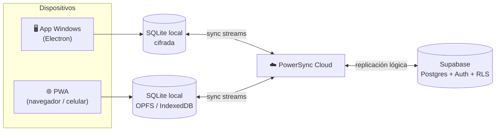

# Delirium Control

**Sistema de gestión offline-first para heladería artesanal**
Ventas, cartera, inventario, producción y control de calidad (BPM) — funciona sin internet y sincroniza solo entre computador, web y celular.

**[⬇️ Descargar la última versión](https://github.com/Brausin/delirium-releases/releases/latest)**

---

## ✨ ¿Qué es?

Delirium Control es el sistema a la medida que administra la operación diaria
del grupo **Delirium** (paletas y pulpas de fruta artesanales): facturación y
envío de facturas por WhatsApp, cuentas por cobrar, inventario multi-punto,
gastos, sociedad, estadísticas y predicción de producción, más los **15
formatos de control de calidad (BPM)** exigidos en planta.

Su rasgo distintivo es que es **offline-first de verdad**: cada dispositivo
trabaja contra su propia base de datos local (SQLite cifrada) y un motor de
sincronización replica los cambios en cuanto hay red. Se puede facturar un día
entero sin internet y nada se pierde ni se pisa.

## 🧭 Características

- 🖥️ **Multiplataforma real**: app de escritorio para Windows (este repositorio), PWA instalable en navegador y celular — todas ven los mismos datos.
- 🔌 **100 % funcional sin internet**; sincronización automática al reconectar, con cola durable y recuperación de errores visible en la UI.
- 🧾 Facturación con numeración a prueba de colisiones entre dispositivos (resolución en el servidor + auditoría).
- 🍧 Control de calidad BPM: 15 formatos diligenciables con historial.
- 🔐 Cifrado de la base local, login con allowlist y RLS en el servidor.
- 📱 Envío de facturas por WhatsApp desde el escritorio.
- 🔄 **Se actualiza sola**: la app descarga cada versión nueva en segundo plano con barra de progreso y se instala al reiniciar.

## 🏗️ Arquitectura

La UI nunca habla con el servidor: lee y escribe **siempre** en la base local,
y la sincronización viaja por detrás. Por eso la app abre al instante y
funciona igual con o sin red.

## 🛠️ Tecnología

| Capa | Stack |
| --- | --- |
| Escritorio | Electron + electron-builder + electron-updater (NSIS, auto-update) |
| Web / móvil | PWA con service worker (precache completo, funciona offline) |
| UI | React 18 · TypeScript estricto · Tailwind CSS |
| Datos locales | SQLite (wa-sqlite WASM) · Drizzle ORM · cifrado ChaCha20 |
| Sincronización | PowerSync (offline-first, sync streams) |
| Backend | Supabase (Postgres, Auth, RLS, Storage) |

## 📦 Sobre este repositorio

Aquí se publican los **instaladores** y el feed de auto-actualización
(`latest.yml`) que consume electron-updater. El código fuente del proyecto es
privado; este repositorio no contiene código ni datos — solo los binarios de
cada versión.

**Instalación manual**: descarga el `Delirium-Control-X.Y.Z-setup.exe` de la
[última release](https://github.com/Brausin/delirium-releases/releases/latest)
y ejecútalo. A partir de ahí, la app se mantiene al día sola.

---

Desarrollado con 🍦 por **[Brausin](https://github.com/Brausin)**

